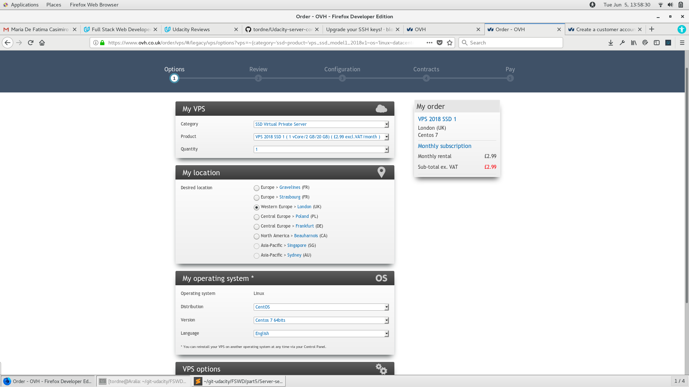

# Udacity FSWD Project 6 - Server Configuration

<!-- MarkdownTOC autolink="true" -->

- [Synopsis](#synopsis)
- [My VPS Configuartions](#my-vps-configuartions)
    - [Public IP](#public-ip)
- [Create a VPS](#create-a-vps)
    - [Options](#options)
    - [Review](#review)
    - [Configuration](#configuration)
    - [Contracts](#contracts)
    - [Billing](#billing)
    - [Login & Passwords](#login--passwords)
        - [OVH account](#ovh-account)
        - [VPS](#vps)
- [Setup your VPS](#setup-your-vps)
    - [Initial Login & setup](#initial-login--setup)
        - [SSH Port](#ssh-port)
        - [Change root password](#change-root-password)
        - [Create a user with sudo privileges](#create-a-user-with-sudo-privileges)
        - [Remove the SSH root login](#remove-the-ssh-root-login)
    - [System Update && Upgrade](#system-update--upgrade)
        - [yum update](#yum-update)
        - [Install Kernel-ml](#install-kernel-ml)
        - [Inline with Upstream Stable repository](#inline-with-upstream-stable-repository)
    - [Install additional packages](#install-additional-packages)
        - [Git](#git)
        - [Server Configuartions](#server-configuartions)
        - [Postgresql](#postgresql)
        - [Python 3.X](#python-3x)
        - [Apache 2.4.33](#apache-2433)
    - [Advanced Server Setup](#advanced-server-setup)
        - [Prompt](#prompt)
        - [Timezone UTC](#timezone-utc)
        - [Secure SSH](#secure-ssh)
        - [Firewall configuration](#firewall-configuration)
        - [Start Apache service](#start-apache-service)
- [References](#references)

<!-- /MarkdownTOC -->


## Synopsis
Reading through the project requirements AWS Lightsail was recommended, as they provide a free trial.
I made an account and created an instance and after going through the inital setup of an Ubuntu VPS the following problems made me decide to choose another VPS provider:

* First I noticed the lack of options of Operating Systems. 
* Instead of using the default ssh key which was created by AWS, I wanted to used the most secure ed25519 and several faults were given that my chosen encryption was not supported.
* Other OS, i.e. RedHat and CentOS uses SELinux which uses MAC (Mandatory Access Control) ontop of DAC (Descretionary Access Control).

For These reasons I decided to create a server on [OVH](https://www.ovh.co.uk) and host our previous projects on the VPS.  
OVH has several choices for your VPS, in this instance we will use the basic [VPS SSD 1](https://www.ovh.co.uk/vps/vps-ssd.xml)

## My VPS Configuartions
### Public IP
```
Your VPS's IPv4 address is: 51.38.83.98
Your VPS's IPv6 address is: 2001:41d0:0801:2000:0000:0000:0000:0d39
```

## Create a VPS
After following the above link press "redeem" and you'll be directed to the order page. When in London use the following settings or change according to your location.

### Options
Choose the following options:

* VPS 2018 SSD 1
* Western Europe > London (UK)
* CentOS
* Centos 7 64bits
* English

and press "continue"

### Review
Choose your preferred plan, monthly, yearly, etc.

and press a gain "continue"

### Configuration
You will need to provide Responsibilities information for:

* Adminitstrator
* Billing
* Technician

Again press "continue"

### Contracts
Read and accept the T&C's and press "continue"

### Billing
Review your invoice and choose a payment option.

### Login & Passwords
#### OVH account
Go to [OVH](https://www.ovh.co.uk/) and login with your OVH account credentials, make sure you enable the (SMS) 2 factor authentication, to secure your account.

#### VPS
You will have received an email with the IP4 IPV6 address of your VPS together with a root login password.

Make sure you change the password upon login.

## Setup your VPS
### Initial Login & setup
Go to a terminal and ssh to the VPS
```bash
ssh root@51.38.83.98
```
Enter your password given in an email send by OVH.

#### SSH Port
To prevent brute force attacks on the default ssh port enter the following commands.
Make a backup of the sshd_config file
```bash
sudo cp /etc/ssh/sshd_config /etc/ssh/sshd_config.bak
```
open the sshd_config file with vi and remove the **#** from te port line and change it to **2200**

Enable the newly created port in SELinux
```bash
sudo semanage port -a -t ssh_port_t -p tcp 2200
```

Add the port 2200 to the fierwall
```bash
sudo firewall-cmd --permanent --zone=public --add-port=2200/tcp
sudo firewall-cmd --reload
```
Reload the **sshd.service**
```bash
sudo systemctl restart sshd.service
```
Verify SSH is now running on port 2200
```bash
ss -tnlp | grep ssh
```
Ths shoud output 2 lines showing ssh with ports 2200

To make sure open a second terminal and login on port 2200
```bash
ssh root@51.38.83.98 -p 2200
```

#### Change root password
Since the original password was send by email, there is always a chance it was compromised in transit. So change the root password.
```bash
passwd root
```

#### Create a user with sudo privileges
To prevent from mistakes being made as a su, A normal user should be created with sudo privileges
```bash
useradd grader
passwd grader
usermod -a -G wheel grader
```

#### Remove the SSH root login
To finish off our basic server ssh configuration, we want to prevent ssh root logins.  
First we will log out and log back in with our new user grader.
```bash
ssh -p 2200 grader@51.38.83.98
sudo vi /etc/ssh/sshd_config
```
go to the line with `#PermitRootLogin yes` and change it to `PermitRootLogin no`

### System Update && Upgrade
#### yum update
Make sure that the basic system has all the latest packages
```bash
sudo yum update
```

#### Install Kernel-ml
Kernels are regularly being update and security holes are plugged, so it is imperative to use the latest kernel updates.  
The following 2 lines will install the elrepo repository and its GPG key.
```bash
sudo rpm --import https://www.elrepo.org/RPM-GPG-KEY-elrepo.org
sudo rpm -Uvh http://www.elrepo.org/elrepo-release-7.0-3.el7.elrepo.noarch.rpm 
```
Install the latest kernel
```bash
sudo yum --enablerepo=elrepo-kernel install kernel-ml
```
Open and edit the file **/etc/default/grub** and set `GRUB_DEFAULT=0` above `GRUB_DISABLE_SUBMENU`  
Then run the following command to recreate the kernel configuartion.  
And reboot the VPS
```bash
sudo grub2-mkconfig -o /boot/grub2/grub.cfg
sudo systemctl reboot
```

#### Inline with Upstream Stable repository
IUS community brings latest software versions to RHEL-based systems.
```bash
sudo yum install https://centos7.iuscommunity.org/ius-release.rpm
```

### Install additional packages
#### Git
Install Git to retrieve additional packages
```bash
sudo yum install git
```

#### Server Configuartions
We will clone several helper files onto the server with git.  
Go to your home directory and clone the Server Config.
```bash
git clone https://github.com/tordne/Udacity-server-config.git
```

#### Postgresql
We'll install postgresql to use for our item-catalog project
```bash
sudo yum install postgresql
```

#### Python 3.X
Install the latest python version.
```bash
sudo yum install python36u python36u-pip
```

#### Apache 2.4.33
We will install the latest apache which will support http2
```bash
sudo yum install httpd24u
```

### Advanced Server Setup
#### Prompt
CentOS default prompt is bland and makes it difficult to view information.
```bash
cd Udacity-server-config
sudo cp prompt.sh /etc/profile.d/
```
`exit` the VPS and log back in with grader, now you will have a fancy prompt.

#### Timezone UTC
The timezone is set in `/etc/localtime` which is a symlink to one of the time zones in `/usr/share/zoneinfo/`.  
To change it we'll use the following command.
```bash
sudo timedatectl set-timezone UTC
```

#### Secure SSH
To protect your VPS against brute force password attacks we'll use passwordless ssh login.  
**On your client do the following:**  
Create a strong ed25519 key
```bash
ssh-keygen -o -a 100 -t ed25519
```
create a config file `~/.ssh/config` with permission **600** and enter:
```bash
Host grader-udacity
  Hostname 51.38.83.98
  Port 2200
  User grader
  PreferredAuthentications publickey
  IdentityFile ~/.ssh/id_ed25519
```
**On your open terminal do the following**  
Copy the contents of public key `id_ed25519.pub` in the file `~/.ssh/authorized_keys`  
Then modify `/etc/ssh/sshd_config` with sudo and change  
`PasswordAuthentication yes` to `PasswordAuthentication no`  
and  
`PubkeyAuthentication no` to `PubkeyAuthentication yes`  
then restart the sshd service
```bash
sudo systemctl sshd.service
```

#### Firewall configuration
Firewalld is active and has multiple zones, of which by default only public is active with several ports.  
We will need to close port 22 and open others i.e. http, https, ntp
```bash
sudo firewall-cmd --permanent --zone=public --add-service=http
sudo firewall-cmd --permanent --zone=public --add-service=https
sudo firewall-cmd --permanent --zone=public --remove-service=ssh
sudo firewall-cmd --reload
```

#### Start Apache service
After installing Apache2.4.33 the service has not yet been enabled. So
```bash
sudo systemctl enable httpd.service
sudo systemctl restart httpd.service
```


## References
[Change default port CentOS 7](https://www.liberiangeek.net/2014/11/change-openssh-port-centos-7/)  
[Secure your SSH](https://www.hugeserver.com/kb/secure-ssh-on-centos-7/)  
[CentOS 7 update kernel](https://www.tecmint.com/install-upgrade-kernel-version-in-centos-7/)
